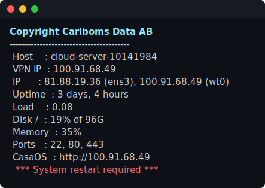
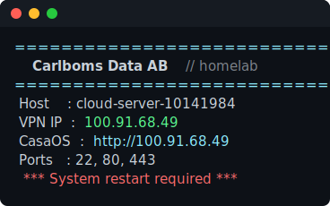
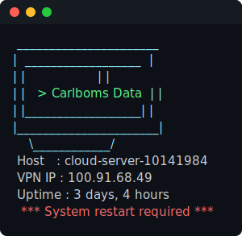

# terminal-banner

The Linux login message is usually blank — or, on Ubuntu, a wall of ads and
upgrade nags. **terminal-banner** replaces it with a colourful, always-current
snapshot of the machine, shown every time you log in over SSH, on the console,
or in a terminal.

<p align="center">
  
</p>

Made for homelabs and small fleets: one command to install, a plain-text
template to edit, and optional one-to-many sync so every machine shows the same
banner.

## Install

```bash
curl -fsSL https://raw.githubusercontent.com/Carlboms-Data-AB/terminal-banner/main/setup.sh | sudo bash
```

An interactive menu opens — just pick a number, nothing to memorise. Works on
Raspberry Pi OS, Debian, Ubuntu, Fedora, RHEL, and Arch.

<p align="center">
  
</p>

The same menu is available on the host afterwards, offline — reopen it any time
to show, edit, or remove the banner:

```bash
sudo terminal-banner
```

## What it can show

Every value is read live at each login, and any line whose value comes back
empty removes itself — so the reboot notice only appears when a reboot is
actually pending. Available building blocks include:

- **Host** — hostname, OS, kernel, architecture, hardware model
- **Network** — LAN IP, VPN/overlay IP (auto-detects NetBird `wt0` / `100.64/10`), gateway, DNS, a clickable service URL
- **Health** — uptime, load average, CPU temperature, Raspberry Pi throttling
- **Capacity** — disk, memory, swap
- **Activity** — listening ports, Docker containers, failed services, logged-in users
- **Alerts** — a red *restart required* line when a reboot is pending

Every available token is listed in full below.

## Edit the banner

The banner is a single file on the host: **`/etc/terminal-banner/message`**.
Pick **Edit the banner** in the menu, or open it directly — changes show at the
next login:

```bash
sudo nano /etc/terminal-banner/message
```

It's a simple template: plain text is shown as-is, `{{TOKENS}}` are replaced
with this host's live values, and `{{COLOUR}}` tokens style the text (emoji work
too).

Preview a design before deploying it — runs on macOS or Linux, needs no root,
and flags any mistyped token:

```bash
tools/preview.sh                      # previews ./message.txt
tools/preview.sh examples/server.txt
```

Colours: `{{RED}}` `{{GREEN}}` `{{YELLOW}}` `{{BLUE}}` `{{MAGENTA}}` `{{CYAN}}`
`{{WHITE}}` `{{BOLD}}` `{{DIM}}` `{{RESET}}`.

<details><summary><b>All tokens</b> (click to expand)</summary>

| Token | Value |
|-------|-------|
| `{{HOSTNAME}}` `{{FQDN}}` | short / fully-qualified name |
| `{{OS}}` `{{OS_ID}}` `{{KERNEL}}` `{{ARCH}}` `{{MODEL}}` | distro, kernel, arch, hardware |
| `{{DATE}}` `{{TIME}}` `{{TIMEZONE}}` `{{UPTIME}}` `{{BOOTED}}` | time / uptime |
| `{{CPU}}` `{{CORES}}` `{{LOAD1}}` `{{LOAD5}}` `{{LOAD15}}` | CPU, load |
| `{{CPU_TEMP}}` `{{THROTTLED}}` | temperature, Pi throttling (hidden when OK) |
| `{{MEMORY}}` `{{MEM}}` `{{MEM_FREE}}` `{{SWAP}}` | memory / swap (swap hidden when none) |
| `{{DISK}}` `{{DISK_FREE}}` `{{DISK_TOTAL}}` | root disk |
| `{{IP}}` `{{IP4}}` `{{IPV6}}` | all IPv4 / primary v4 / primary v6 |
| `{{VPNIP}}` | VPN/overlay IP (auto-detects NetBird `wt0`/`netbird` or `100.64/10`) |
| `{{IFACE}}` `{{GATEWAY}}` `{{DNS}}` `{{MAC}}` `{{PORTS}}` | route, DNS, MAC, listening ports |
| `{{DOCKER}}` `{{FAILED}}` | containers, failed units (hidden when none) |
| `{{USERS}}` `{{SESSIONS}}` `{{WHO}}` | logged-in users |
| `{{REBOOT}}` | red "restart required" when pending |
| `{{PUBIP}}` `{{UPDATES}}` | public IP / pending updates *(sync mode, or a cron — see below)* |
| `{{IP_<IFACE>}}` | that interface's IPv4, e.g. `{{IP_ETH0}}` |
| `{{URL_<IFACE>_PORT_<PORT>}}` | clickable URL, e.g. `{{URL_WT0_PORT_80}}` → `http://<wt0-ip>` (443→https, 80→http) |

`{{PUBIP}}`/`{{UPDATES}}` read a cached value. Sync mode refreshes it; in local
mode add a cron if you want them:
```bash
# /etc/cron.d/terminal-banner-cache
*/30 * * * * root sh -c 'curl -fs --max-time 4 https://api.ipify.org > /var/lib/terminal-banner/pubip'
```
</details>

Or start from a ready-made example in [`examples/`](examples/):

| Example | Preview |
|---------|---------|
| [`server.txt`](examples/server.txt) — full system summary |  |
| [`branded.txt`](examples/branded.txt) — coloured header + link |  |
| [`ascii-art.txt`](examples/ascii-art.txt) — ASCII art + colour |  |

## Sync one banner to a fleet (optional)

By default the banner is **local**: it lives on each host, you edit it there,
and nothing is fetched after install.

To manage many machines from one place, choose **sync**: at the install prompt,
paste a raw `message.txt` URL — e.g.
`https://raw.githubusercontent.com/USER/REPO/main/message.txt`. Each host then
pulls that file every ~15 minutes, so you edit once and every synced machine
follows. Re-run the installer and press Enter to switch back to local.

## Security

The banner renders **locally** at login — via `/etc/update-motd.d` on
Debian/Ubuntu/Raspberry Pi OS, or a shell snippet elsewhere. The renderer treats
the template as **data, never code**:

- tokens are string-substituted; the template is **never** `eval`'d or executed;
- the ESC byte is stripped, so a template can't smuggle in terminal escape
  sequences.

So even a banner delivered by sync can only change **text** — it cannot run
commands, even though rendering happens as root.

## Uninstall

```bash
sudo terminal-banner-uninstall        # local, no network
```

Or pick **Uninstall** in the menu. It restores the machine's original login
message.

## Files

| File | Role |
|------|------|
| `setup.sh` | the menu-driven installer (renderer, default banner, and sync updater embedded) |
| `message.txt` | the default banner |
| `examples/` | ready-made templates |
| `tools/preview.sh` | preview a template with sample data |
| `tools/render-svg.py` | generate the README screenshots |

## License

[Apache-2.0](LICENSE) © Carlboms Data AB.
